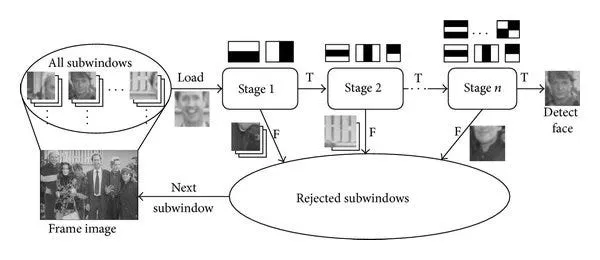
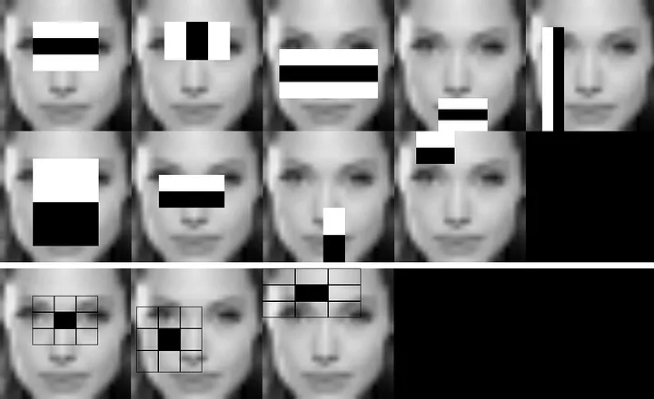

# Haar Cascade classifier from OpenCV library in Python

## Haar Cascade is a popular algorithm for facial detection that can be easily implemented using OpenCV library in Python.

### What is Haar Cascade?
Haar Cascade is a machine learning-based algorithm used to detect objects in images or videos. 
The algorithm uses a set of Haar-like features, which are rectangular patterns of pixel values, to distinguish between the object and the background. 
The algorithm trains a classifier using these features, which can then be used to detect objects in new images or videos.

### Haar Cascade for Facial Detection
Haar Cascade is particularly well-suited for facial detection because the Haar-like features can be used to distinguish between facial features such as the eyes, nose, and mouth.
The algorithm detects faces by first creating a Haar Cascade classifier using a set of positive and negative images.
The positive images contain faces, while the negative images do not.

The classifier is then used to scan a new image or video for faces.
The scanning process involves sliding a window of fixed size over the image and applying the classifier to each window.
If the classifier detects a face in the window, it is marked as a potential face. 
The potential faces are then filtered based on their size, position, and shape to reduce false positives.

